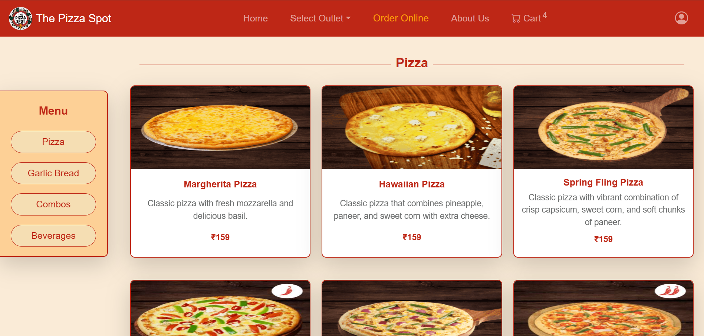
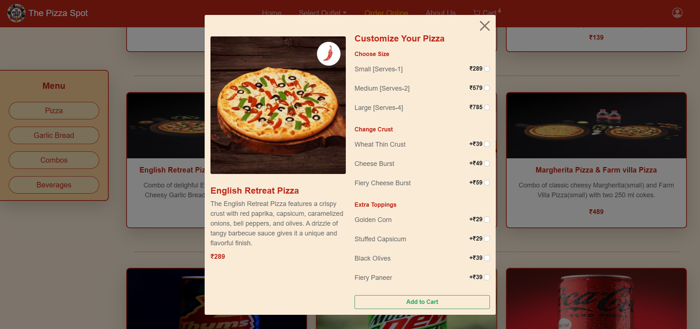
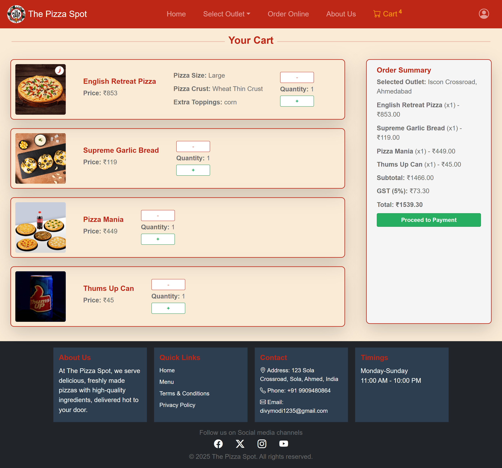

# 🍕 The Pizza Spot

> **A delicious full-stack pizza ordering web application built with HTML, CSS, JavaScript, and Bootstrap**

[](https://thepizzaspot.netlify.app)
[](https://developer.mozilla.org/en-US/docs/Web/HTML)
[](https://developer.mozilla.org/en-US/docs/Web/CSS)
[](https://developer.mozilla.org/en-US/docs/Web/JavaScript)
[](https://getbootstrap.com/)

## 🌟 Features

### 🔐 **User Authentication**
- **Login System** - Secure user authentication with form validation
- **Signup System** - New user registration with mobile number validation
- **Form Validation** - Client-side validation for all input fields

### 🍕 **Menu & Ordering**
- **Interactive Menu** - Browse pizzas, garlic bread, combos, and beverages
- **Pizza Customization** - Choose size, crust type, and extra toppings
- **Real-time Pricing** - Dynamic price calculation based on selections
- **Shopping Cart** - Add, remove, and manage items with quantity controls

### 🏪 **Multi-Outlet Support**
- **Outlet Selection** - Choose from multiple locations in Ahmedabad
- **Location-based Ordering** - Orders are tied to selected outlets

### 📱 **Responsive Design**
- **Mobile-First** - Optimized for all device sizes
- **Bootstrap Integration** - Modern, responsive UI components
- **Touch-Friendly** - Mobile-optimized interactions

### 🎨 **Modern UI/UX**
- **Custom Color Palette** - Fiery red, basil green, and warm tones
- **Interactive Elements** - Hover effects and smooth transitions
- **Professional Layout** - Clean, modern design with proper spacing

## 📸 Screenshots

### 🍕 **Application Preview**

#### 🏠 **Homepage**


#### 🍕 **Order Online Page**


#### 🎨 **Pizza Customization**


#### 🛒 **Shopping Cart**


> 📱 *Screenshots showcase the beautiful UI and responsive design of The Pizza Spot*

## 🚀 Quick Start

### 🌐 **Live Demo**
**🎉 Try it now!** Visit the live application: **[thepizzaspot.netlify.app](https://thepizzaspot.netlify.app)**

### Installation
1. **Clone the repository**
   ```bash
   git clone https://github.com/DivyModi07/The-Pizza-Spot.git
   cd the-pizza-spot
   ```

2. **Open the application**
   - Simply double-click on `test1.html` to open in your web browser
   - Or right-click and select "Open with" → your preferred browser

3. **Start ordering!** 🍕
   - Select your preferred outlet
   - Browse the menu and customize your pizza
   - Add items to cart and proceed to checkout

## 📁 Project Structure

```
The Pizza Spot/
├── 📄 test1.html          # Main application page
├── 📄 login.html          # User login page
├── 📄 signup.html         # User registration page
├── 🎨 test1.css           # Main stylesheet
├── 🎨 login.css           # Login page styles
├── 🎨 signup.css          # Signup page styles
├── ⚡ test1.js            # Main JavaScript functionality
├── 🎨 color-palette-1.txt # Color scheme reference
└── 📁 images/             # All project images
    ├── 🍕 pizza-logo-1.jpeg
    ├── 🍕 order-online-pizza*.jpg
    ├── 🥖 order-online-garlic-bread*.jpg
    ├── 🍽️ order-online-combo*.jpg
    ├── 🥤 order-online-beverage*.jpg
    └── 🖼️ Carousel-*.jpg
```
